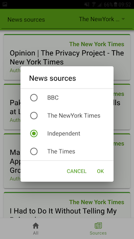

# News app

## Ülevaade:
Tegemist on uudiste äpiga, mis näitab esimesel lehel uudiste pealkirju erinevatest väljaannetest. Nendel klikkides avaneb leht koos uudise lühikirjelduse ja lingiga veebilehele (tasuta API piirangu tõttu ei ole võimalik kuvada tervet uudise sisu). Teisel lehel on samamoodi uudised, kuid seal on võimalik valida 4 erineva väljaande vahel ning kuvada ainult valitut. 
Äpp kasutab uudiste saamiseks https://newsapi.org API-t.

## Juhend:
https://youtu.be/NJ9C7iY9350 

#### Arvamus juhendist:
Juhend oli alustuseks üsna põhjalik ning andis ülevaate kasutatavates failides toimuvast. Juhendis seletatati, mida kasutatavad funktsioonid teevad ning, mis põhimõttel Ionic töötab. Süvitsi aga see väga ei läinud ning edasiseks äpi täiendamiseks pidi palju juurde uurima.

Midagi negatiivset juhendis otseselt polnud, kuid samas edasiseks täiendamiseks jäi veidi algeliseks.  

## SDK versiooni muutused:
Ei pidanud otseselt midagi muutma.

## Juhendi muutused:
Lisasin juurde teise lehe koos uudiste väljaannete valikuga.
Lisaks muutsin äpi välimust.
